# Go 微服务网关

## 仓库
- **Github 后端: https://github.com/qingolang/go-gateway**
- **Github 后台管理端: https://github.com/qingolang/go-gateway-view**
- **Gitee 后端: https://gitee.com/qingolang/go-gateway**
- **Gitee 后台管理端: https://gitee.com/qingolang/go-gateway-view**

## 功能
  - **支持代理协议**
    - HTTP/HTTPS
    - WEBSOCKET
    - GRPC
    - TCP
  - **服务负载均衡策略**
    - 轮询
    - 权重轮询
    - 随机
    - HASH
  - **服务发现:主动探测/自动服务发现**
  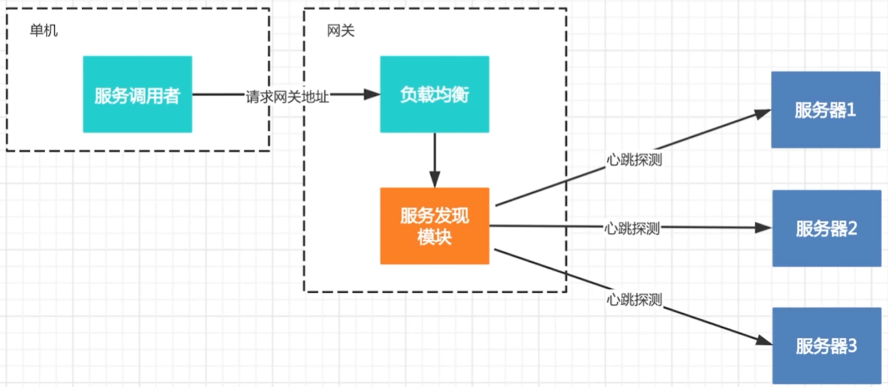
  - **限流**
    - 在实际项目中，对访问流量的限制，可采用如下几种常见技术方法
      - 队列方法
      - 令牌桶方法可采用：[hystrix-go](https://github.com/afex/hystrix-go)
      - 计数器方法可依赖 golang.org/x/time/rate 进行实现相关设计 **当前方案**
  - **权限认证**
    - IP白名单
    - IP黑名单
    - JWT租户
    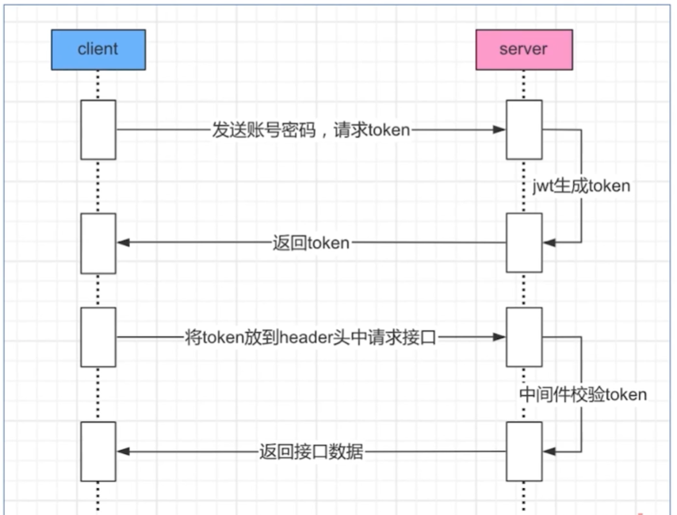
    - API白名单(HTTP)

## 网络
  - **OSI七层网络协议**
  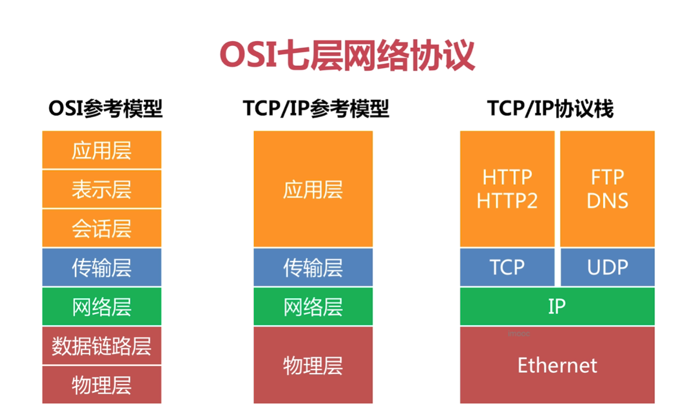
  - **TCP数据包构成**
  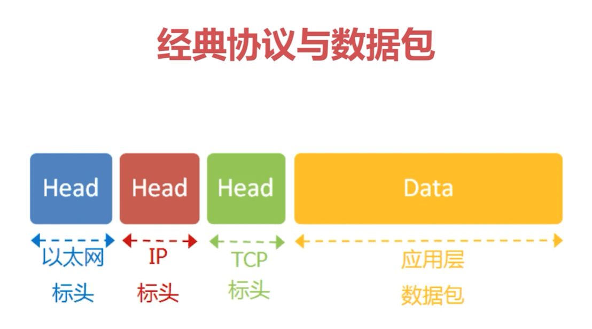
  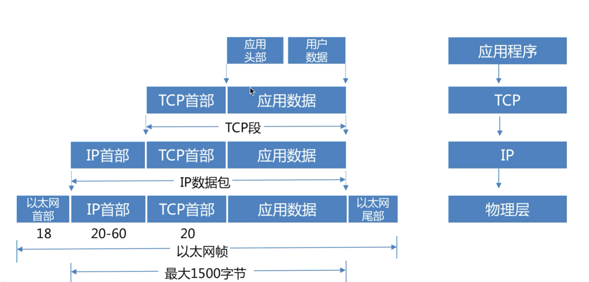
  - **TCP的三次握手与四次挥手**
  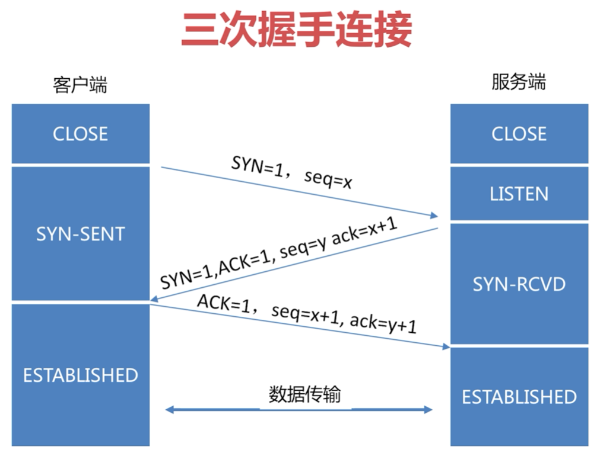
  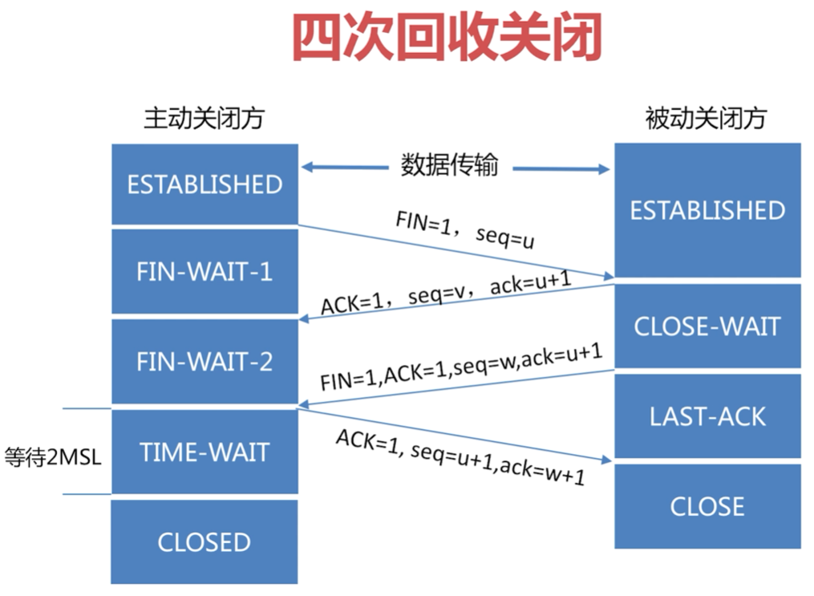
  - **HTTP协议**
  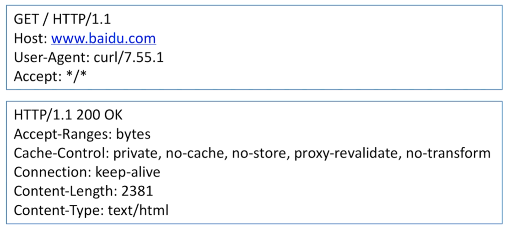
  - **WEBSOCKET协议与数据包构成**
  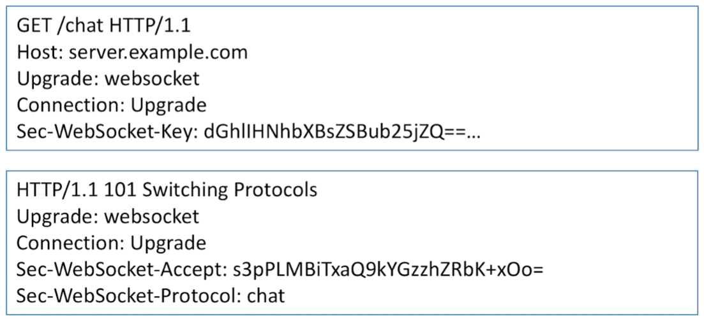
  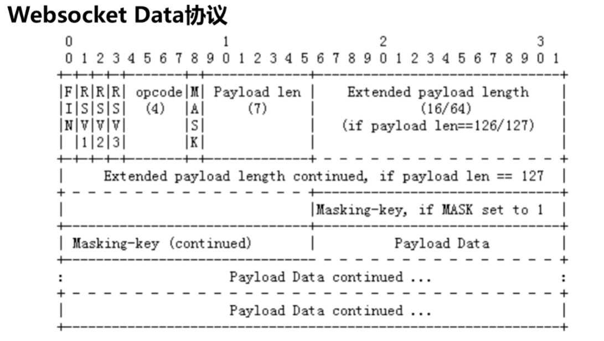
  - **GRPC抓包分析**
  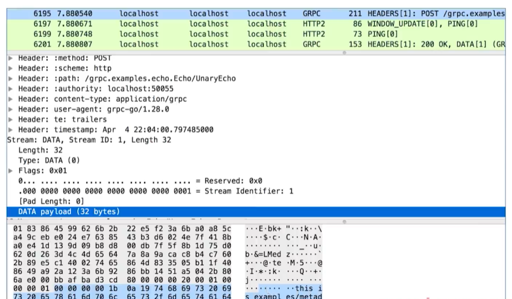
  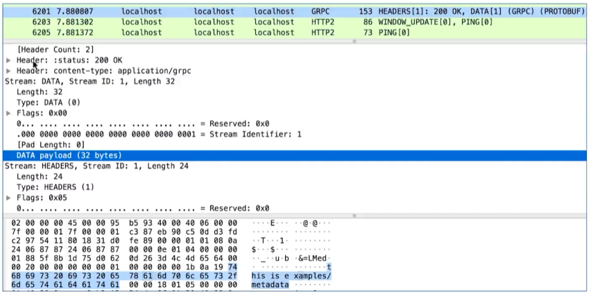
  
## 代理
  - **HTTP**
  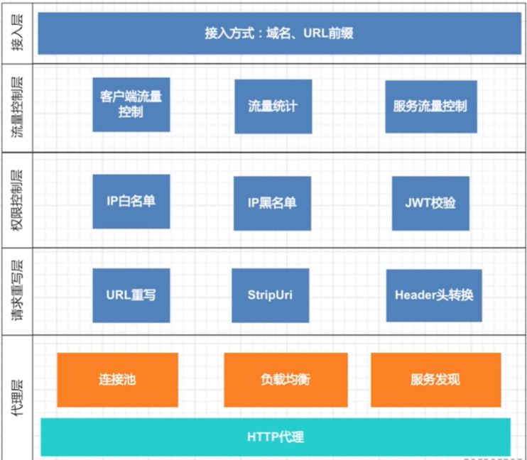
  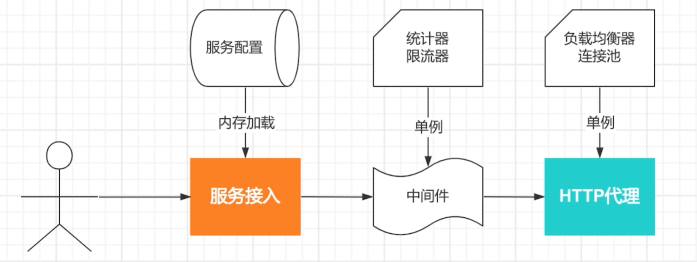
  - **TCP**
  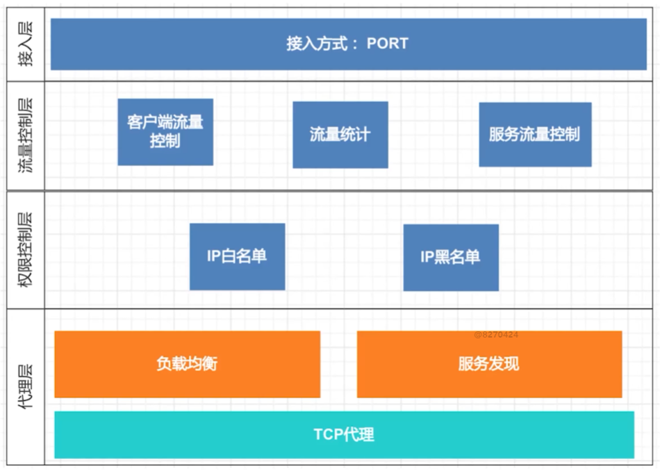
  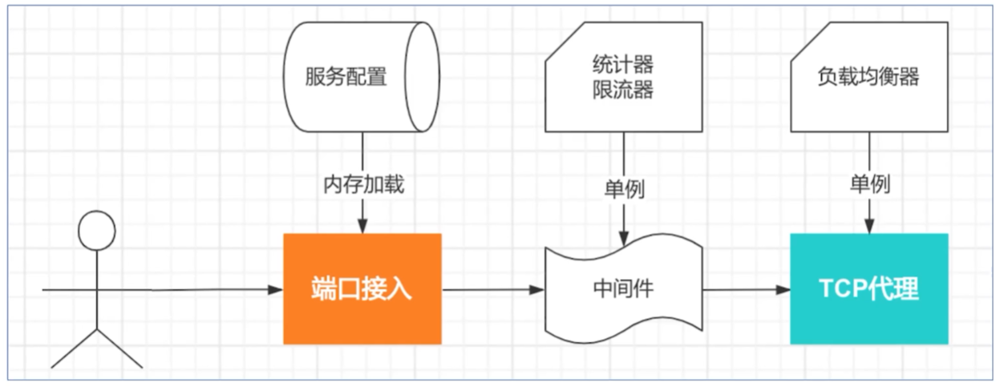
  - **GRPC**
  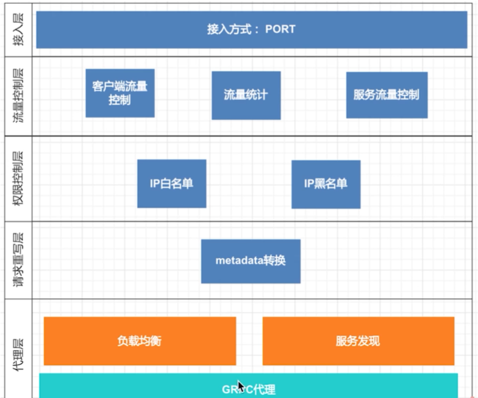
  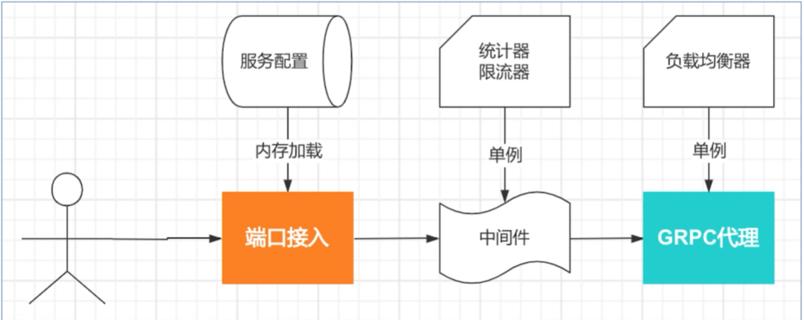